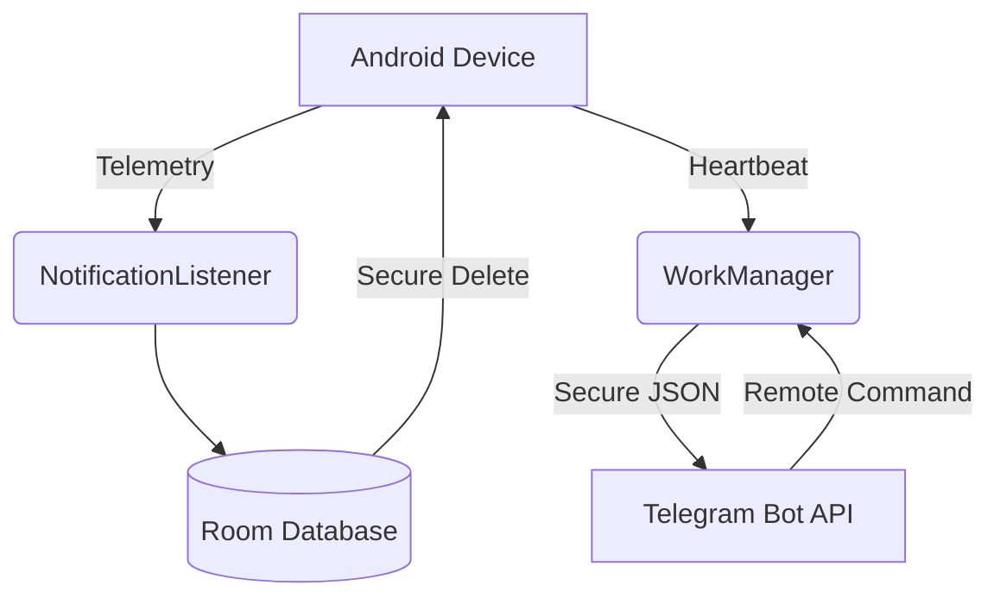

  <h1 align="center">Zero-Sentinel</h1>
  

    <strong>Absolute Privacy. Granular Monitoring. Full Vibe Coding.</strong>
  

  
  
  

Zero-Sentinel (Internal: **CyperBot**) adalah ekosistem parental control Android yang dirancang dengan filosofi "Zero-Knowledge". Project ini lahir dari **keresahan pribadi** terhadap solusi monitoring komersial yang seringkali mengabaikan privasi data dan memiliki infrastruktur yang berat.

Project ini dikerjakan dengan pendekatan **Full Vibe Coding**—di mana setiap baris kode ditulis bukan sekadar untuk memenuhi requirement, tapi untuk mencapai harmoni antara efisiensi, estetika antarmuka, dan ketangguhan sistem. 

Berbeda dengan solusi lain yang bergantung pada cloud storage, Zero-Sentinel beroperasi secara mandiri menggunakan Telegram Bot API sebagai infrastruktur Command & Control (C2) yang tangguh dan terenkripsi.

---

## 🛠️ Main Features

| Feature | Description |
| :--- | :--- |
| **🎭 Stealth Decoy** | Menyamar sebagai "SIM Menu". Akses UI asli melalui PIN rahasia. |
| **📡 Passive Monitoring** | Logging WiFi SSID & GPS secara periodik setiap 15 menit. |
| **🛡️ Resilience** | Menggunakan WorkManager & Device Admin agar tetap aktif di background. |
| **🧹 Data Hygiene** | Penghapusan log secara aman (secure wipe) setelah berhasil upload. |
| **🤖 Serverless** | Memanfaatkan Telegram sebagai C2, tanpa biaya VPS. |
| **🔒 Secure Access** | Manajemen PIN jarak jauh & enkripsi AES-256 lokal. |

---

## 🏗️ Architecture

---

## 🚀 Technical Documentation

### Core Components
*   **Telemetry Engine**: `SentinelNotificationListener` menangkap pesan & alert secara independen.
*   **C2 Interface**: `C2Worker` (WorkManager) melakukan polling & upload setiap 15 menit secara senyap.
*   **Stealth Engine**: `SIMMenuActivity` (Decoy), `StealthManager` (Icon Hiding), & `SecureDelete`.
*   **Security Core**: `EncryptedSharedPreferences` (AES-256) & `SentinelDeviceAdminReceiver`.

### Commands (C2)
Kendalikan agent melalui Telegram Bot:
*   `/ping`: Cek status & jadwal wake-up berikutnya. Returns "Pong!" dan log terakhir.
*   `/wipe`: Paksa penghapusan seluruh log & records database di perangkat.
*   `/setpin <PIN>`: Ubah PIN akses aplikasi secara remote.

---

## 📦 Installation & Setup

1.  **Download**: Ambil APK terbaru dari [Releases](https://github.com/arinadi/CyperBot/releases).
2.  **Open "SIM Menu"**: Klik **"Help and Support"** dan masukkan PIN default `123123`.
3.  **Onboarding**: Berikan izin yang diminta (Notification Access, Battery Opts, Device Admin).
4.  **Configure**: Masukkan Telegram Bot Token & Chat ID Anda.
5.  **Secure**: Segera ubah default PIN melalui menu settings.

---

## 🛠️ Build from Source

1.  **Prerequisites**: JDK 21, Android SDK API 34.
2.  **Secrets**: Tambahkan `TELEGRAM_BOT_TOKEN` di `local.properties`.
3.  **Command**: `./gradlew assembleRelease`

---

  <i>Developed with ❤️ and a lot of vibes. Project ID: <code>Zero-Sentinel</code></i>

